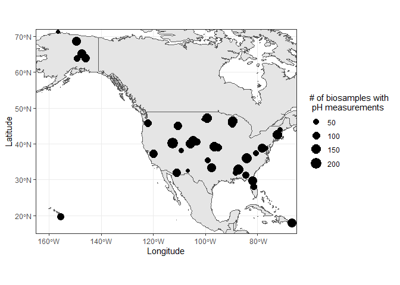
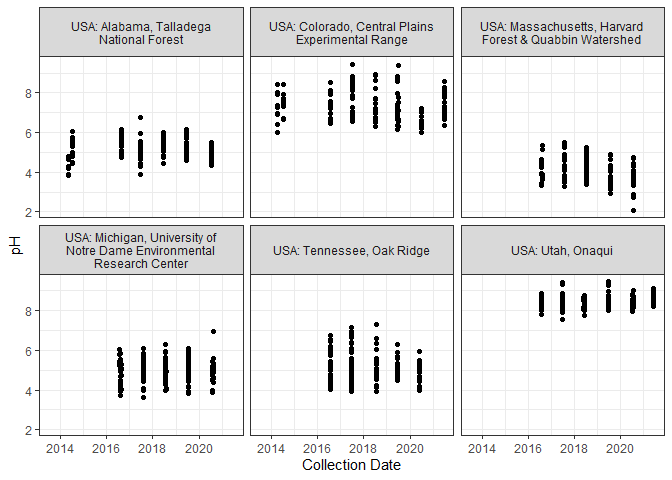

example_nmdc_api_interactions
================
2023-10-11

Rshiny app to plot pH measurements for soil samples as a function of
time by NEON site

# Get samples associated with NEON sites

name.search:National Ecological Observatory Network request url
<https://api.microbiomedata.org/studies?filter=name.search%3ANational%20Ecological%20Observatory%20Network&per_page=25>

``` r
base_url = "https://api.microbiomedata.org"
# meta_count = 0
# page_chunk = 100
# while (meta_count < page_chunk){
#     url = paste0(
#         base_url, "/studies?filter=name.search%3ANational%20Ecological%20Observatory%20Network&per_page=", page_chunk)
# }
#    

url = paste0(base_url, "/studies?filter=name.search%3ANational%20Ecological%20Observatory%20Network&per_page=50")
#TODO: check pagination

response = fromJSON(url)
study_ids = response[["results"]][["id"]]
```

# M

``` r
bio_samps  = list()
ph = list()
for (i in 1:length(study_ids)){
    study_id = study_ids[i]
    filt = paste0("part_of:", study_id)
    url = paste0(base_url, "/biosamples?filter=", filt)
    resp = fromJSON(url)
    bio_samps[i] = resp[['results']]['id']
    ph[i] = resp[['results']]['ph']
}
```

``` r
per_page = 100
dat_all = tibble()
for (i in 1:length(study_ids)){
    study_id = study_ids[i]
    filt = paste0("part_of:", study_id)
    get_more = TRUE
    tot = 0
    page = 1
    while (get_more){
        url = paste0(
            base_url, 
            "/biosamples?filter=", 
            filt,
            "&per_page=",
            per_page,
            "&page=",
            page)
        print(url)
        data = fromJSON(url)
        data_results = data[['results']] %>% as.data.frame()
        dat_all = bind_rows(dat_all, data_results)
        if (nrow(dat_all) < data[['meta']]['count']){
            page = page +1
        } else { get_more = FALSE}
    }
}
```

    ## [1] "https://api.microbiomedata.org/biosamples?filter=part_of:nmdc:sty-11-34xj1150&per_page=100&page=1"
    ## [1] "https://api.microbiomedata.org/biosamples?filter=part_of:nmdc:sty-11-34xj1150&per_page=100&page=2"
    ## [1] "https://api.microbiomedata.org/biosamples?filter=part_of:nmdc:sty-11-34xj1150&per_page=100&page=3"
    ## [1] "https://api.microbiomedata.org/biosamples?filter=part_of:nmdc:sty-11-34xj1150&per_page=100&page=4"
    ## [1] "https://api.microbiomedata.org/biosamples?filter=part_of:nmdc:sty-11-34xj1150&per_page=100&page=5"
    ## [1] "https://api.microbiomedata.org/biosamples?filter=part_of:nmdc:sty-11-34xj1150&per_page=100&page=6"
    ## [1] "https://api.microbiomedata.org/biosamples?filter=part_of:nmdc:sty-11-34xj1150&per_page=100&page=7"
    ## [1] "https://api.microbiomedata.org/biosamples?filter=part_of:nmdc:sty-11-34xj1150&per_page=100&page=8"
    ## [1] "https://api.microbiomedata.org/biosamples?filter=part_of:nmdc:sty-11-34xj1150&per_page=100&page=9"
    ## [1] "https://api.microbiomedata.org/biosamples?filter=part_of:nmdc:sty-11-34xj1150&per_page=100&page=10"
    ## [1] "https://api.microbiomedata.org/biosamples?filter=part_of:nmdc:sty-11-34xj1150&per_page=100&page=11"
    ## [1] "https://api.microbiomedata.org/biosamples?filter=part_of:nmdc:sty-11-34xj1150&per_page=100&page=12"
    ## [1] "https://api.microbiomedata.org/biosamples?filter=part_of:nmdc:sty-11-34xj1150&per_page=100&page=13"
    ## [1] "https://api.microbiomedata.org/biosamples?filter=part_of:nmdc:sty-11-34xj1150&per_page=100&page=14"
    ## [1] "https://api.microbiomedata.org/biosamples?filter=part_of:nmdc:sty-11-34xj1150&per_page=100&page=15"
    ## [1] "https://api.microbiomedata.org/biosamples?filter=part_of:nmdc:sty-11-34xj1150&per_page=100&page=16"
    ## [1] "https://api.microbiomedata.org/biosamples?filter=part_of:nmdc:sty-11-34xj1150&per_page=100&page=17"
    ## [1] "https://api.microbiomedata.org/biosamples?filter=part_of:nmdc:sty-11-34xj1150&per_page=100&page=18"
    ## [1] "https://api.microbiomedata.org/biosamples?filter=part_of:nmdc:sty-11-34xj1150&per_page=100&page=19"
    ## [1] "https://api.microbiomedata.org/biosamples?filter=part_of:nmdc:sty-11-34xj1150&per_page=100&page=20"
    ## [1] "https://api.microbiomedata.org/biosamples?filter=part_of:nmdc:sty-11-34xj1150&per_page=100&page=21"
    ## [1] "https://api.microbiomedata.org/biosamples?filter=part_of:nmdc:sty-11-34xj1150&per_page=100&page=22"
    ## [1] "https://api.microbiomedata.org/biosamples?filter=part_of:nmdc:sty-11-34xj1150&per_page=100&page=23"
    ## [1] "https://api.microbiomedata.org/biosamples?filter=part_of:nmdc:sty-11-34xj1150&per_page=100&page=24"
    ## [1] "https://api.microbiomedata.org/biosamples?filter=part_of:nmdc:sty-11-34xj1150&per_page=100&page=25"
    ## [1] "https://api.microbiomedata.org/biosamples?filter=part_of:nmdc:sty-11-34xj1150&per_page=100&page=26"
    ## [1] "https://api.microbiomedata.org/biosamples?filter=part_of:nmdc:sty-11-34xj1150&per_page=100&page=27"
    ## [1] "https://api.microbiomedata.org/biosamples?filter=part_of:nmdc:sty-11-34xj1150&per_page=100&page=28"
    ## [1] "https://api.microbiomedata.org/biosamples?filter=part_of:nmdc:sty-11-34xj1150&per_page=100&page=29"
    ## [1] "https://api.microbiomedata.org/biosamples?filter=part_of:nmdc:sty-11-34xj1150&per_page=100&page=30"
    ## [1] "https://api.microbiomedata.org/biosamples?filter=part_of:nmdc:sty-11-34xj1150&per_page=100&page=31"
    ## [1] "https://api.microbiomedata.org/biosamples?filter=part_of:nmdc:sty-11-34xj1150&per_page=100&page=32"
    ## [1] "https://api.microbiomedata.org/biosamples?filter=part_of:nmdc:sty-11-34xj1150&per_page=100&page=33"
    ## [1] "https://api.microbiomedata.org/biosamples?filter=part_of:nmdc:sty-11-34xj1150&per_page=100&page=34"
    ## [1] "https://api.microbiomedata.org/biosamples?filter=part_of:nmdc:sty-11-34xj1150&per_page=100&page=35"
    ## [1] "https://api.microbiomedata.org/biosamples?filter=part_of:nmdc:sty-11-34xj1150&per_page=100&page=36"
    ## [1] "https://api.microbiomedata.org/biosamples?filter=part_of:nmdc:sty-11-34xj1150&per_page=100&page=37"
    ## [1] "https://api.microbiomedata.org/biosamples?filter=part_of:nmdc:sty-11-34xj1150&per_page=100&page=38"
    ## [1] "https://api.microbiomedata.org/biosamples?filter=part_of:nmdc:sty-11-34xj1150&per_page=100&page=39"
    ## [1] "https://api.microbiomedata.org/biosamples?filter=part_of:nmdc:sty-11-34xj1150&per_page=100&page=40"
    ## [1] "https://api.microbiomedata.org/biosamples?filter=part_of:nmdc:sty-11-34xj1150&per_page=100&page=41"
    ## [1] "https://api.microbiomedata.org/biosamples?filter=part_of:nmdc:sty-11-34xj1150&per_page=100&page=42"
    ## [1] "https://api.microbiomedata.org/biosamples?filter=part_of:nmdc:sty-11-34xj1150&per_page=100&page=43"
    ## [1] "https://api.microbiomedata.org/biosamples?filter=part_of:nmdc:sty-11-34xj1150&per_page=100&page=44"
    ## [1] "https://api.microbiomedata.org/biosamples?filter=part_of:nmdc:sty-11-34xj1150&per_page=100&page=45"
    ## [1] "https://api.microbiomedata.org/biosamples?filter=part_of:nmdc:sty-11-hht5sb92&per_page=100&page=1"
    ## [1] "https://api.microbiomedata.org/biosamples?filter=part_of:nmdc:sty-11-pzmd0x14&per_page=100&page=1"

``` r
library(lubridate)
my_theme <- theme_bw()
df <- dat_all %>%
    select(
      collection_date, ph, geo_loc_name, lat_lon
      ) %>%
    unnest(
      cols = c(
        collection_date, 
        geo_loc_name,
        lat_lon
        ), names_sep = "_") %>%
    rename(collection_date = collection_date_has_raw_value ,
           geo_loc = geo_loc_name_has_raw_value)

df2 <- df %>%
    mutate(collection_date2 = as.Date(collection_date))

df3 <- df2 %>%
  mutate(geo_loc_grouped = geo_loc %>% 
           factor() %>% 
           fct_lump(n = 6)
         ) %>%
  filter(geo_loc_grouped != "Other")
  

g <- ggplot(data = df2) +
    geom_point(aes(x=collection_date, y = ph)) +
  my_theme +
    facet_wrap(facets = vars(geo_loc))

g <- ggplot(data = df3) +
    geom_point(aes(x=collection_date2, y = ph)) +
    my_theme +
    scale_x_date()+
    facet_wrap(facets = vars(geo_loc_grouped),
               labeller = label_wrap_gen(width=30)) 
g
```

    ## Warning: Removed 60 rows containing missing values (`geom_point()`).

<!-- -->

``` r
library("rnaturalearth")
```

    ## The legacy packages maptools, rgdal, and rgeos, underpinning the sp package,
    ## which was just loaded, were retired in October 2023.
    ## Please refer to R-spatial evolution reports for details, especially
    ## https://r-spatial.org/r/2023/05/15/evolution4.html.
    ## It may be desirable to make the sf package available;
    ## package maintainers should consider adding sf to Suggests:.

    ## Support for Spatial objects (`sp`) will be deprecated in {rnaturalearth} and will be removed in a future release of the package. Please use `sf` objects with {rnaturalearth}. For example: `ne_download(returnclass = 'sf')`

``` r
library("rnaturalearthdata")
```

    ## 
    ## Attaching package: 'rnaturalearthdata'

    ## The following object is masked from 'package:rnaturalearth':
    ## 
    ##     countries110

``` r
locs_with_ph <- df2 %>%
  group_by(
    geo_loc
    ) %>%
  mutate(
    count_with_ph = n()
    ) %>%
  select(
    geo_loc, 
    lat_lon_longitude, 
    lat_lon_latitude,
    count_with_ph
    ) %>%
  distinct()

world <- ne_countries(scale = "medium", returnclass = "sf")
class(world)
```

    ## [1] "sf"         "data.frame"

``` r
g2 <- ggplot(data = world) +
    geom_sf() +
    geom_point(
        data = locs_with_ph, 
        aes(x = lat_lon_longitude, y = lat_lon_latitude, 
        size = count_with_ph)) +
    my_theme +
    labs(x = "Longitude", y = "Latitude", size = "Samples with \n pH measurements")+
    theme()+
        coord_sf(xlim = c(-165, -66), ylim = c(17, 72), expand = FALSE)
g2
```

<!-- -->
