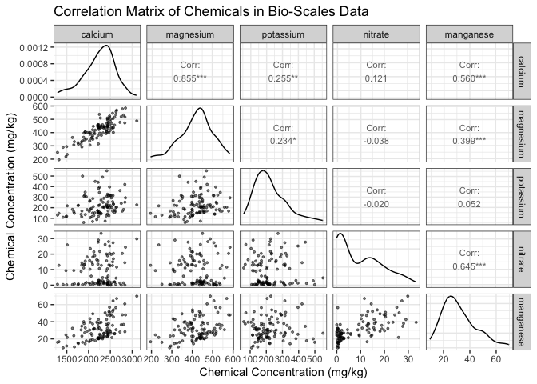

Bio-Scales metadata exploration
================
2023-11-21

## Get study IDs associated with Bio-Scales sites using API

``` r
base_url = "https://api.microbiomedata.org"
url = paste0(base_url, "/studies?filter=title.search:Bio-Scales")

response = fromJSON(url)
study_ids = response[["results"]][["id"]]
print(study_ids)
```

    ## [1] "nmdc:sty-11-r2h77870"

## Using the study ids, pull out bio sample IDs

Note that we are pulling 100 records at a time until we have retrieved
all biosamples for the three study ids above, place the data retrieved
for each bio sample into a tibble.

``` r
study_id = study_ids[1]

# Prepare a tibble to hold results
dat_all = tibble()

# Set up query
per_page = 100  # number of records to retrieve per page
filt = paste0("part_of:", study_id) # filter to only get biosamples from the study of interest
get_more = TRUE # flag to indicate whether we need to get more records
page = 1 # page number to retrieve
while (get_more){
    # construct the url for the query
    url = paste0(
        base_url, 
        "/biosamples?filter=", 
        filt,
        "&per_page=",
        per_page,
        "&page=",
        page)
    # get the data
    data = fromJSON(url)
    data_results = data[['results']] %>% as.data.frame() 
    # add the data to the tibble
    dat_all = bind_rows(dat_all, data_results)
    # check if we need to get more records
    if (nrow(dat_all) < data[['meta']]['count']){
        page = page +1
    } else { get_more = FALSE}
}

glimpse(dat_all)
```

    ## Rows: 416
    ## Columns: 43
    ## $ id                         <chr> "nmdc:bsm-11-6zd5nb38", "nmdc:bsm-11-ahpvvb…
    ## $ name                       <chr> "Rhizosphere soil microbial communities fro…
    ## $ description                <chr> "Rhizosphere soil microbial communities fro…
    ## $ part_of                    <list> "nmdc:sty-11-r2h77870", "nmdc:sty-11-r2h77…
    ## $ env_broad_scale            <df[,2]> <data.frame[26 x 2]>
    ## $ env_local_scale            <df[,2]> <data.frame[26 x 2]>
    ## $ env_medium                 <df[,2]> <data.frame[26 x 2]>
    ## $ host_taxid                 <df[,2]> <data.frame[26 x 2]>
    ## $ collected_from             <chr> "nmdc:frsite-11-xckqtm38", "nmdc:frsite-…
    ## $ type                       <chr> "nmdc:Biosample", "nmdc:Biosample", "nmd…
    ## $ img_identifiers            <list> "img.taxon:3300046665", "img.taxon:33000…
    ## $ samp_name                  <chr> "BESC-904-Co3_16_51 rhizosphere", "GW-95…
    ## $ gold_biosample_identifiers <list> "gold:Gb0291773", "gold:Gb0291786", "gold:G…
    ## $ elev                       <dbl> 62, 1, 62, 62, 62, 1, 62, 62, 1, 62, 62, 62…
    ## $ geo_loc_name               <df[,1]> <data.frame[26 x 1]>
    ## $ lat_lon                    <df[,3]> <data.frame[26 x 3]>
    ## $ samp_taxon_id              <df[,2]> <data.frame[26 x 2]>
    ## $ ecosystem                  <chr> "Host-associated", "Host-associated", "Hos…
    ## $ ecosystem_category         <chr> "Plants", "Plants", "Plants", "Plants", "Pl…
    ## $ ecosystem_type             <chr> "Roots", "Roots", "Roots", "Roots", "Roots…
    ## $ ecosystem_subtype          <chr> "Rhizosphere", "Rhizosphere", "Rhizosphere"…
    ## $ specific_ecosystem         <chr> "Soil", "Soil", "Soil", "Soil", "Soil", …
    ## $ add_date                   <chr> "2021-05-03T00:00:00", "2021-05-03T00:00…
    ## $ habitat                    <chr> "Rhizosphere soil", "Rhizosphere soil", …
    ## $ host_name                  <chr> "Populus", "Populus", "Populus", "Populus",…
    ## $ location                   <chr> "USA", "USA", "USA", "USA", "USA", "USA", "…
    ## $ mod_date                   <chr> "2021-05-03T00:00:00", "2021-05-03T00:00:00…
    ## $ ncbi_taxonomy_name         <chr> "rhizosphere metagenome", "rhizosphere meta…
    ## $ sample_collection_site     <chr> "Rhizosphere Soil", "Rhizosphere Soil", "Rh…
    ## $ collection_date            <df[,1]> <data.frame[26 x 1]>
    ## $ depth                      <df[,3]> <data.frame[26 x 3]>
    ## $ ph                         <dbl> NA, NA, NA, NA, NA, 5.41, 6.95, 6.23, 5.14,…
    ## $ calcium                    <df[,3]> <data.frame[26 x 3]>
    ## $ magnesium                  <df[,3]> <data.frame[26 x 3]>
    ## $ potassium                  <df[,3]> <data.frame[26 x 3]>
    ## $ tot_nitro                  <df[,3]> <data.frame[26 x 3]>
    ## $ lbc_thirty                 <df[,3]> <data.frame[26 x 3]>
    ## $ lbceq                      <df[,3]> <data.frame[26 x 3]>
    ## $ manganese                  <df[,3]> <data.frame[26 x 3]>
    ## $ zinc                       <df[,3]> <data.frame[26 x 3]>
    ## $ ammonium_nitrogen          <df[,3]> <data.frame[26 x 3]>
    ## $ nitrate_nitrogen           <df[,3]> <data.frame[26 x 3]>
    ## $ nitrite_nitrogen           <df[,3]> <data.frame[26 x 3]>

## Clean up results

Pull out biosample_id and associated chemical metadata; unnest as needed

``` r
df <- dat_all %>%
    select(
        id, ecosystem_subtype,
        calcium, magnesium, potassium, nitrate_nitrogen, manganese, zinc
    ) %>%
    unnest(
        cols = c(
            ecosystem_subtype,
            calcium, magnesium, potassium, nitrate_nitrogen, manganese, zinc
        ), names_sep = "_") %>%
    select(id, ecosystem_subtype, 
           contains("has_numeric_value"),
           contains("has_unit"))
glimpse(df)
```

    ## Rows: 416
    ## Columns: 14
    ## $ id                                 <chr> "nmdc:bsm-11-6zd5nb38", "nmdc:bsm-1…
    ## $ ecosystem_subtype                  <chr> "Rhizosphere", "Rhizosphere", "Rhiz…
    ## $ calcium_has_numeric_value          <dbl> NA, NA, NA, NA, NA, 2774.35, 2511.0…
    ## $ magnesium_has_numeric_value        <dbl> NA, NA, NA, NA, NA, 578.148, 502.77…
    ## $ potassium_has_numeric_value        <dbl> NA, NA, NA, NA, NA, 168.200, 315.91…
    ## $ nitrate_nitrogen_has_numeric_value <dbl> NA, NA, NA, NA, NA, 20.4010, 0.0000…
    ## $ manganese_has_numeric_value        <dbl> NA, NA, NA, NA, NA, 48.0908, 26.617…
    ## $ zinc_has_numeric_value             <dbl> NA, NA, NA, NA, NA, 13.1545, 4.0774…
    ## $ calcium_has_unit                   <chr> NA, NA, NA, NA, NA, "mg/kg", "mg/kg…
    ## $ magnesium_has_unit                 <chr> NA, NA, NA, NA, NA, "mg/kg", "mg/kg…
    ## $ potassium_has_unit                 <chr> NA, NA, NA, NA, NA, "mg/kg", "mg/kg…
    ## $ nitrate_nitrogen_has_unit          <chr> NA, NA, NA, NA, NA, "mg/kg", "mg/kg…
    ## $ manganese_has_unit                 <chr> NA, NA, NA, NA, NA, "mg/kg", "mg/kg…
    ## $ zinc_has_unit                      <chr> NA, NA, NA, NA, NA, "mg/kg", "mg/kg…

## Unit check

Check that all units are the same before dropping from dataframe

``` r
# Check that all units are the same before dropping from dataframe
unit_check <- df %>%
    select(contains("has_unit")) %>%
    distinct() 

glimpse(unit_check)
```

    ## Rows: 2
    ## Columns: 6
    ## $ calcium_has_unit          <chr> NA, "mg/kg"
    ## $ magnesium_has_unit        <chr> NA, "mg/kg"
    ## $ potassium_has_unit        <chr> NA, "mg/kg"
    ## $ nitrate_nitrogen_has_unit <chr> NA, "mg/kg"
    ## $ manganese_has_unit        <chr> NA, "mg/kg"
    ## $ zinc_has_unit             <chr> NA, "mg/kg"

## More dataframe cleaning

Since all units are the same, drop from dataframe; rename columns for
easier reading and plotting

``` r
df <- df %>%
    select(-contains("has_unit")) %>%
    rename(
        calcium = calcium_has_numeric_value,
        magnesium = magnesium_has_numeric_value,
        potassium = potassium_has_numeric_value,
        nitrate = nitrate_nitrogen_has_numeric_value,
        manganese = manganese_has_numeric_value,
        zinc = zinc_has_numeric_value
    ) 
glimpse(df)
```

    ## Rows: 416
    ## Columns: 8
    ## $ id                <chr> "nmdc:bsm-11-6zd5nb38", "nmdc:bsm-11-ahpvvb55", "nmd…
    ## $ ecosystem_subtype <chr> "Rhizosphere", "Rhizosphere", "Rhizosphere", "Rhizos…
    ## $ calcium           <dbl> NA, NA, NA, NA, NA, 2774.35, 2511.03, 2596.00, 1841.…
    ## $ magnesium         <dbl> NA, NA, NA, NA, NA, 578.148, 502.777, 456.241, 331.5…
    ## $ potassium         <dbl> NA, NA, NA, NA, NA, 168.200, 315.919, 154.895, 113.5…
    ## $ nitrate           <dbl> NA, NA, NA, NA, NA, 20.4010, 0.0000, 2.1000, 12.8740…
    ## $ manganese         <dbl> NA, NA, NA, NA, NA, 48.0908, 26.6171, 25.9704, 34.86…
    ## $ zinc              <dbl> NA, NA, NA, NA, NA, 13.1545, 4.0774, 2.1120, 5.2868,…

## Plot chemical data in a correlation matrix

Create paired correlation matrix using GGally package’s [ggpairs
function](https://ggobi.github.io/ggally/articles/ggpairs.html)

``` r
g <- ggpairs(df, 
        columns = c(3:7), 
        title = "Correlation Matrix of Chemicals in Bio-Scales Data",
        lower = list(continuous = wrap("points", alpha = 0.5, size = 0.7)),
        upper = list(continuous = wrap("cor", size = 3))) +
    theme_bw() +
    labs(
        x = "Chemical Concentration (mg/kg)",
        y = "Chemical Concentration (mg/kg)"
    )
g
```

<!-- -->
